# SM-CPTD — A novel cloud workflow scheduling algorithm based on stable matching game theory

## Overview
This repository presents an experimental implementation and evaluation of a **workflow scheduling pipeline inspired by the SM-CPTD approach**, combining critical-path analysis, stable matching–based task assignment, and selective task duplication.
The focus of this repository is on experimental evaluation, reproducibility, and empirical analysis, while detailed algorithmic and implementation aspects are documented in the dedicated README within the `algorithms/` directory.

The scheduling pipeline is conceptually organized into three stages:

1. **Dynamic Critical Path** computation for task ranking and critical-path identification.
2. **Stable Matching Game Theory** scheduling, which assigns tasks to virtual machines (VMs) level by level, prioritizing critical-path tasks.
3. **List of Task Duplication**, which improves the schedule by duplicating selected tasks (in this implementation, only entry tasks) to reduce communication overhead.

The repository contains a full experimental pipeline and plotting scripts for reproducing the experimental results and figures presented in the paper.

Reference: 
*[“A stable matching-based algorithm for task scheduling in cloud computing” (Journal of Supercomputing, 2021).](https://link.springer.com/article/10.1007/s11227-021-03742-3)*

### Main objectives:
- Implement the scheduling pipeline (DCP → SMGT → LOTD) on real Pegasus workflow graphs.
- Conduct controlled experimental evaluations under varying communication-to-computation ratios (CCR) and VM counts.
- Collect and store metrics in machine-readable formats.
- Generate figures suitable for empirical analysis and comparison.

### Project Structure

```
stable-matching-game-theory/
├── README.md
├── algorithms/                         Java implementation and experiment runners
│   ├── AblationExperimentRunner.java    Runs the ablation study
│   ├── CCRAnalyzer.java                 Collects CCR-sweep snapshots and writes a JSON analysis report
│   ├── DataLoader.java                  Loads workflow DAG structure and generates numeric parameters (seeded)
│   ├── DCP.java                         Dynamic Critical Path ranking and critical-path extraction
│   ├── ExperimentRunner.java            Runs the main experiments and saves results (CSV/JSON)
│   ├── GanttChartGenerator.java         Exports schedule timing/assignments to JSON for Gantt visualization
│   ├── GanttChartVisualizer.java        Visualization of Gantt JSON 
│   ├── LOTD.java                        List of Task Duplication (here: duplicates entry tasks when beneficial)
│   ├── Main.java                        Entry point 
│   ├── Metrics.java                     Metrics computation (ET, SLR, AVU, satisfaction, VF, communication cost)
│   ├── PegasusXMLParser.java            Converts Pegasus DAX XML workflows to CSV datasets
│   ├── README.md                        Algorithm-specific notes
│   ├── SeededRandom.java                Centralized deterministic randomness for reproducible runs
│   ├── SMCPTD.java                      Orchestrates the full pipeline: DCP → SMGT → LOTD + metrics
│   ├── SMGT.java                        Stable matching-based task-to-VM assignment (level by level)
│   ├── Utility.java                     Shared helpers (e.g., DAG level/topological organization)
│   ├── VM.java                          VM model (processing capacity, bandwidth matrix, threshold/waiting list)
│   └── task.java                        Task model (size, rank, predecessors/successors)
├── clean.sh
├── docs/                               Report and paper material
│   ├── QESM_Report_Cappetti_Peppicelli.pdf
│   └── s11227-021-03742-3.pdf
├── generators/                         Python scripts for analysis and plotting
│   ├── analyze_ccr_sensitivity.py
│   ├── generate_paper_figures.py
│   └── visualize_dag.py
├── requirement.txt                     
├── results/                            Stored results and generated figures
│   ├── experiments_results.json
│   └── figures/                        Generated figures (PNG)
├── run.sh
├── run_gantt_visualizer.sh
└── workflow/                           Pegasus XML workflows (input)
   ├── cybershake/
   ├── epigenomics/
   ├── ligo/
   └── montage/
```

### Requirements

- **Java**: OpenJDK 23.0.2 (Temurin) or compatible JDK 17+
  - Download: [Eclipse Temurin](https://adoptium.net/)
- **Python 3**: Only required for figure generation
- **Python packages**: `pandas`, `matplotlib`, `seaborn`, `numpy`

Install Python dependencies:

```bash
pip3 install pandas matplotlib
```

## Running Experiments

Recommended Execution (from repository root):

```bash
./run.sh
```
This script performs the following steps:
1) runs `PegasusXMLParser` (generates CSV datasets under `data/`).
2) compiles and runs `Main`.
3) `Main` runs `ExperimentRunner` and then tries to generate figures automatically using Python (if available).

#### Arguments

The Java runners accept a small set of CLI flags:

1. **Experiment selection**:
   - `--exp1`: run the CCR sweep only
   - `--exp2`: run the VM-count sweep only

2. **Workflow selection**:
   - `--workflow=<name>`: restrict to one workflow (`cybershake`, `epigenomics`, `ligo`, `montage`)

3. **Reproducibility**:
   - `--seed=<long>` or `--seed <long>`: set the base seed (used by `SeededRandom`)
   - `--fixed-seed`: use the same seed for all runs (for comparing ablation vs normal runs with identical data)

Examples:

```bash
cd algorithms

# CCR sweep only
java ExperimentRunner --exp1

# VM-count sweep only
java ExperimentRunner --exp2

# Only Montage
java ExperimentRunner --exp1 --workflow=montage

# Fixed seed for reproducibility
java Main --seed=123

# Optional fixed seed with same data across all runs (useful for ablation comparison)
java ExperimentRunner --seed=123 --fixed-seed
java AblationExperimentRunner --seed=123 --fixed-seed
```

## Experiments and Results

All experiments are implemented in `algorithms/ExperimentRunner.java`.

## Experiment 1 — CCR Sensitivity Analysis
This experiment evaluates the impact of the communication-to-computation ratio (CCR) on scheduling performance.

Experimental setup: 

- Workflows: `cybershake`, `epigenomics`, `ligo`, `montage`.
- CCR values: 0.4 → 2.0 (step 0.2).
- Problem sizes:
  - *Small*: 5 VMs and ~50 tasks (Epigenomics uses 47).
  - *Medium*: 10 VMs and 100 tasks.
  - *Large*: 50 VMs and ~1000 tasks (Epigenomics uses 997).

This experiment also writes CCR sensitivity JSON snapshots via `CCRAnalyzer` under `results/ccr_sensitivity/`.

### Results and figures
The CCR sensitivity analysis highlights the expected trade-off between computation and communication costs:
- SLR generally increases with higher CCR values, reflecting increased communication overhead.
- AVU decreases as communication dominates computation, indicating reduced effective VM utilization.
- Larger workflows exhibit smoother trends, while smaller workflows show higher variance.

The plots below are shown for clarity and quick visual inspection; the full analysis and discussion are reported in `docs/QESM_Report_Cappetti_Peppicelli.pdf`.

| Comparison of SLR values across CCRs for workflows of increasing size (small, medium, and large). |
|----------------|
|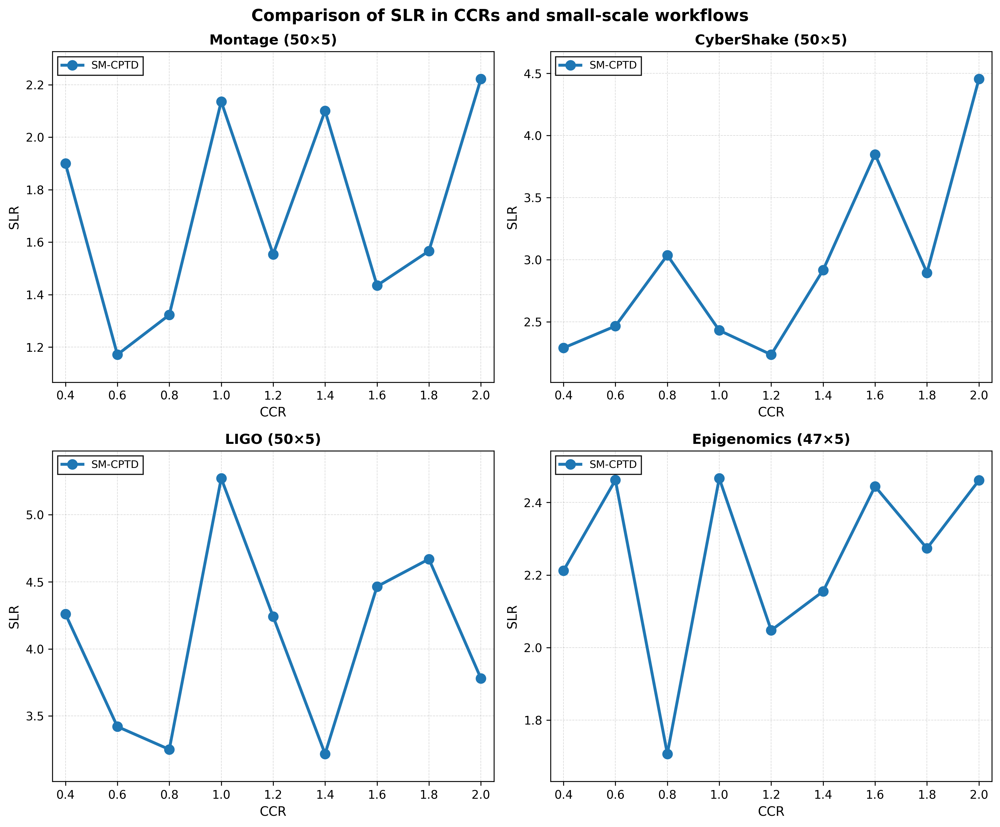 |
|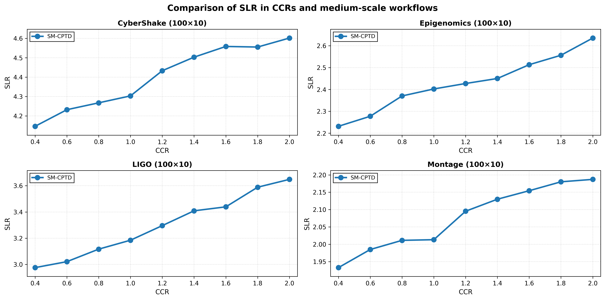 |
|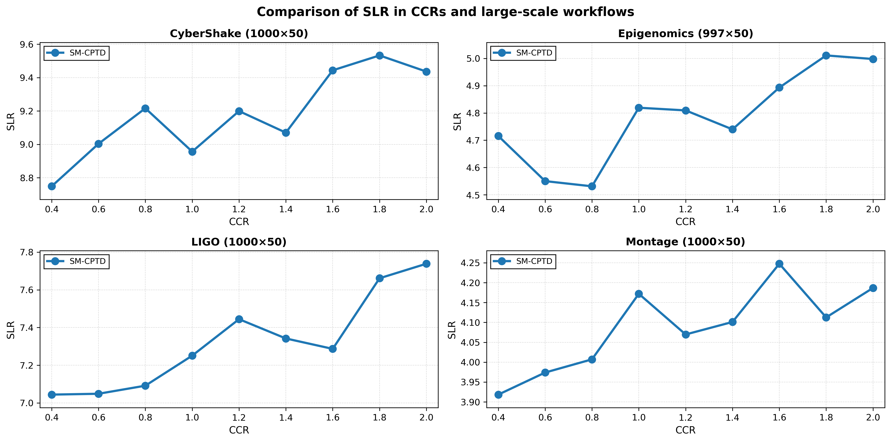 |


| Comparison of AVU values across CCRs for workflows of increasing size (small, medium, and large). |
|----------------|
|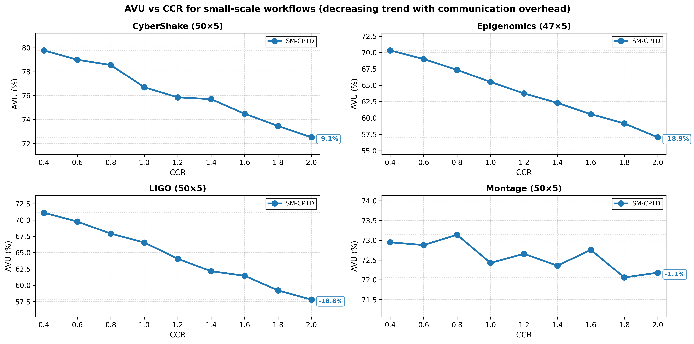 |
|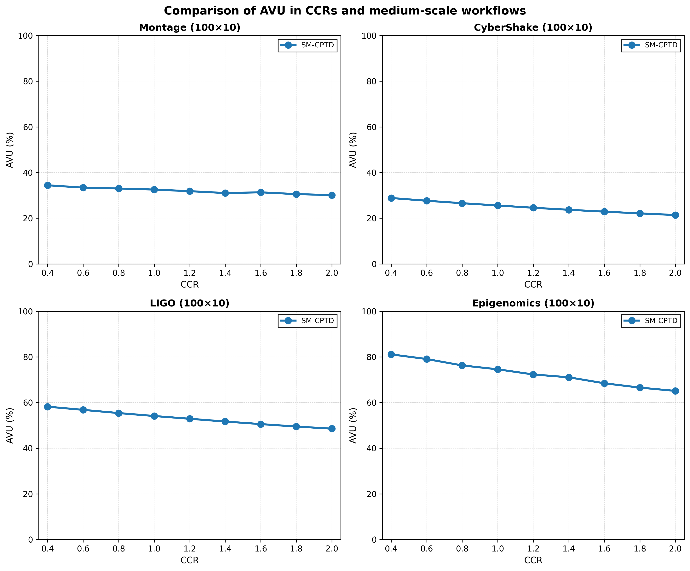 |
|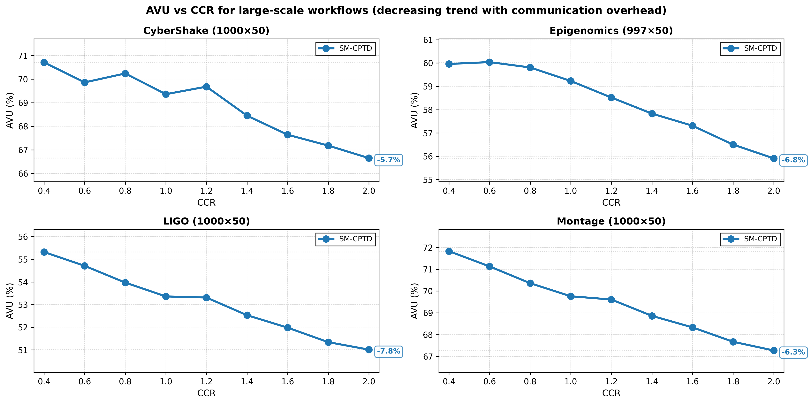 |

## Experiment 2 — VM Count Scalability

This experiment analyzes scalability with respect to the number of available VMs. 
- Fixed CCR: 1.0.
- VM counts: 30, 35, 40, 45, 50, 55, 60, 65, 70.
- Tasks: ~1000 (Epigenomics uses 997).

### Results and figures
When increasing the number of VMs:
- Makespan and SLR decrease initially, then plateau as parallelism saturates.
- AVU decreases with higher VM counts, reflecting underutilization in highly overprovisioned settings.

The plots below are shown for clarity and quick visual inspection; the full analysis and discussion are reported in `docs/QESM_Report_Cappetti_Peppicelli.pdf`.

| Comparison of SLR and AVU values across different numbers of VMs (large-scale workflows, CCR = 1.0). |
|----------------|
|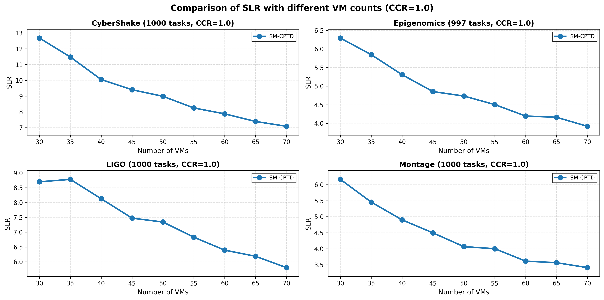 |
|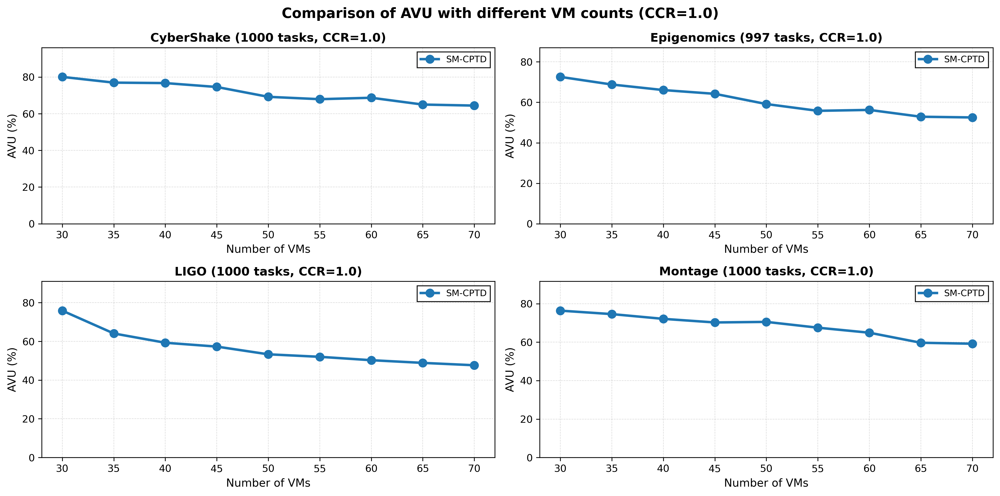 |

## Fairness Analysis — Variance Factor (VF)
In addition to makespan-oriented metrics, the evaluation includes a fairness-oriented metric named VF (Variance Factor).

Each task is associated with a *satisfaction* value defined as:

$$\text{satisfaction}(t_i)=\frac{ET(t_i,\;\text{assigned VM})}{\min_k ET(t_i,\;VM_k)}$$

This ratio is always $\ge 1$ (values closer to 1 indicate that the task is executed on a VM close to its best possible option).
Then, **VF** is computed as the (population) variance of satisfaction across all scheduled tasks: 
$$VF = \frac{1}{n} \sum_{i=1}^{n} (M - S_i)^2 $$
Where $$S_i$$ is the satisfaction of the 
𝑖-th task and $$M$$ is the mean satisfaction across all tasks.

Interpretation:
- **Lower VF** means *more uniform* satisfaction across tasks (i.e., a fairer allocation).
- **Higher VF** means satisfaction is more uneven (some tasks are much more penalized than others).

### Results and figures
The plots below are shown for clarity and quick visual inspection; the full analysis and discussion are reported in `docs/QESM_Report_Cappetti_Peppicelli.pdf`.

| VF across workflows (large-scale, 50 VMs, CCR=1.0). |
|----------------|
|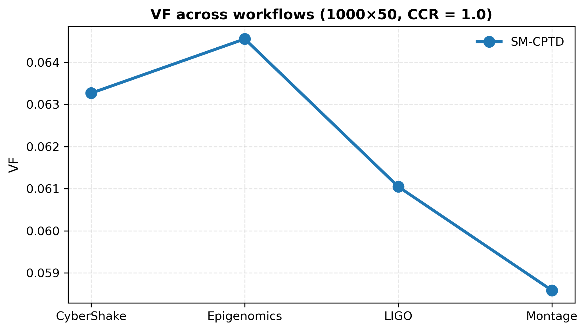 |

| Average task satisfaction across workflows (large-scale, CCR=1.0). |
|----------------|
| |


## Ablation Study

To quantify the contribution of individual pipeline components, an ablation study is provided via `algorithms/AblationExperimentRunner.java`.

The runner evaluates four variants on the large-scale workflows (about 1000 tasks, 50 VMs, CCR = 1.0):

1. **SMGT only** (baseline)
2. **DCP + SMGT** (critical-path prioritization)
3. **SMGT + LOTD** (task duplication refinement)
4. **DCP + SMGT + LOTD** (full SM-CPTD pipeline)

### Results and figures
The ablation compares SLR, AVU, and VF across workflows to highlight how each component impacts performance and fairness.

The ablation results show that:
- Critical-path prioritization (DCP) improves makespan-related metrics.
- Task duplication (LOTD) further refines schedules by reducing communication delays.
- The full SM-CPTD pipeline consistently outperforms partial variants in terms of SLR, AVU, and fairness.

The plots below are shown for clarity and quick visual inspection; the full analysis and discussion are reported in `docs/QESM_Report_Cappetti_Peppicelli.pdf`.

| Ablation study results: SLR, AVU, and VF. |
|----------------|
|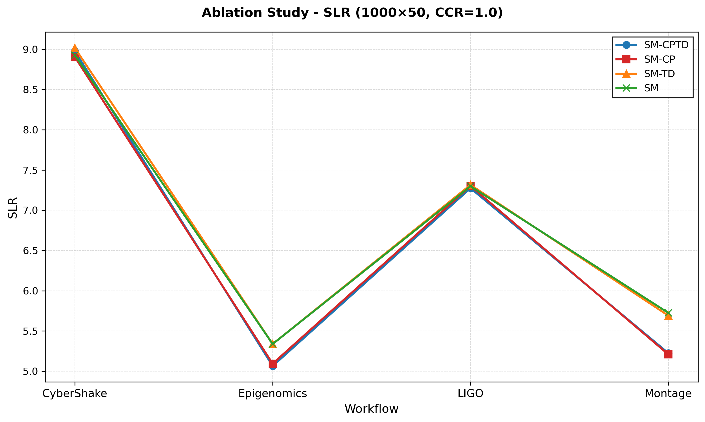 |
|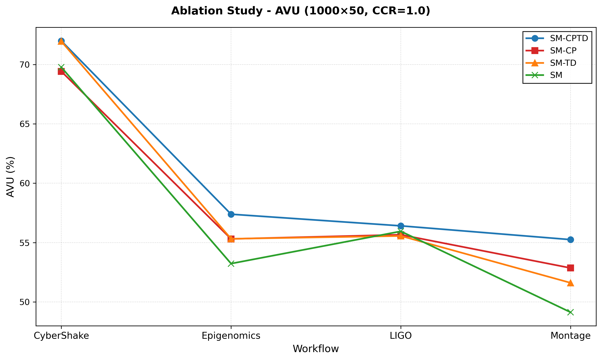 |
| |

## Conclusion

Across all workflows and experimental settings, the results confirm the expected trade-offs:
- Increasing CCR increases communication overhead, which typically increases SLR/makespan and reduces AVU.
- In the scalability experiment, increasing the number of VMs reduces SLR/makespan at first, then shows diminishing returns, while AVU decreases as the system becomes more overprovisioned.

Overall, the SM-CPTD pipeline provides a practical scheduling approach that balances makespan-oriented objectives with fairness-aware allocation, and the ablation study highlights that combining critical-path prioritization (DCP) and selective duplication (LOTD) is beneficial compared to the SMGT-only baseline.

## References

- [Z. hong Jia, L. Pan, X. Liu, and X. jun Li. A novel cloud workflow scheduling algorithm based on stable matching game theory. ](https://link.springer.com/article/10.1007/s11227-021-03742-3) The Journal of Supercomputing, 77(10):11597–11624, 2021.
- [DAX-file: workflows dax format](https://github.com/adnanetalha/DAX-file).


